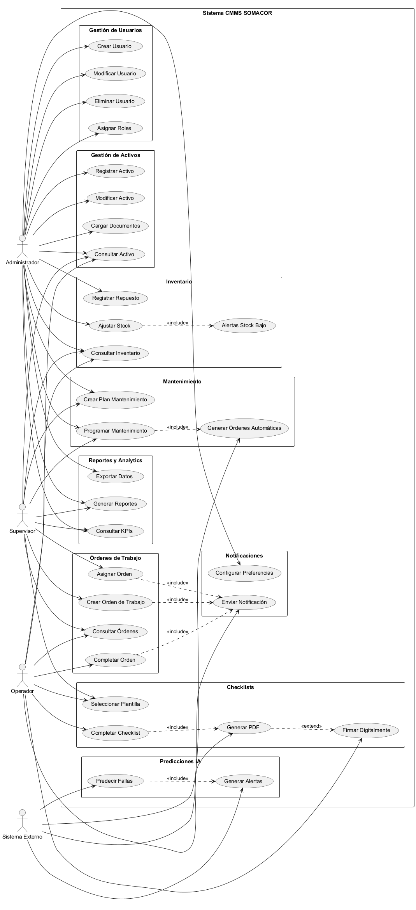
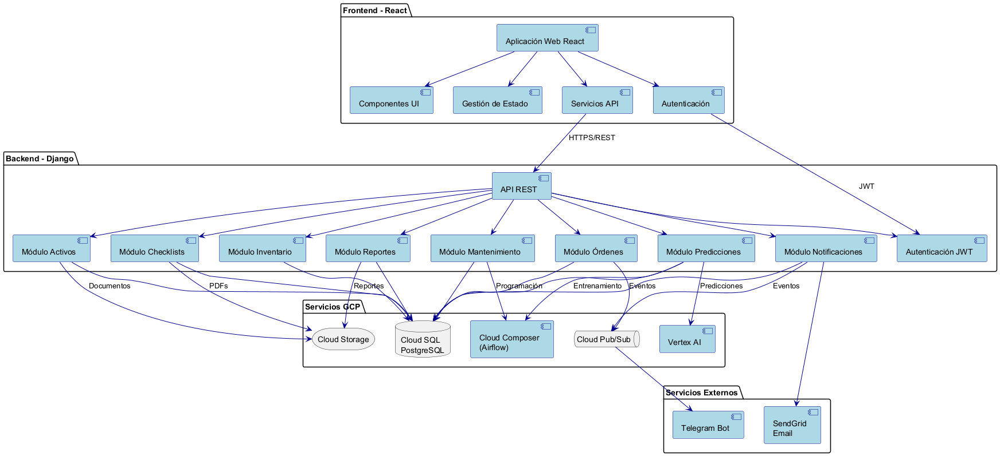
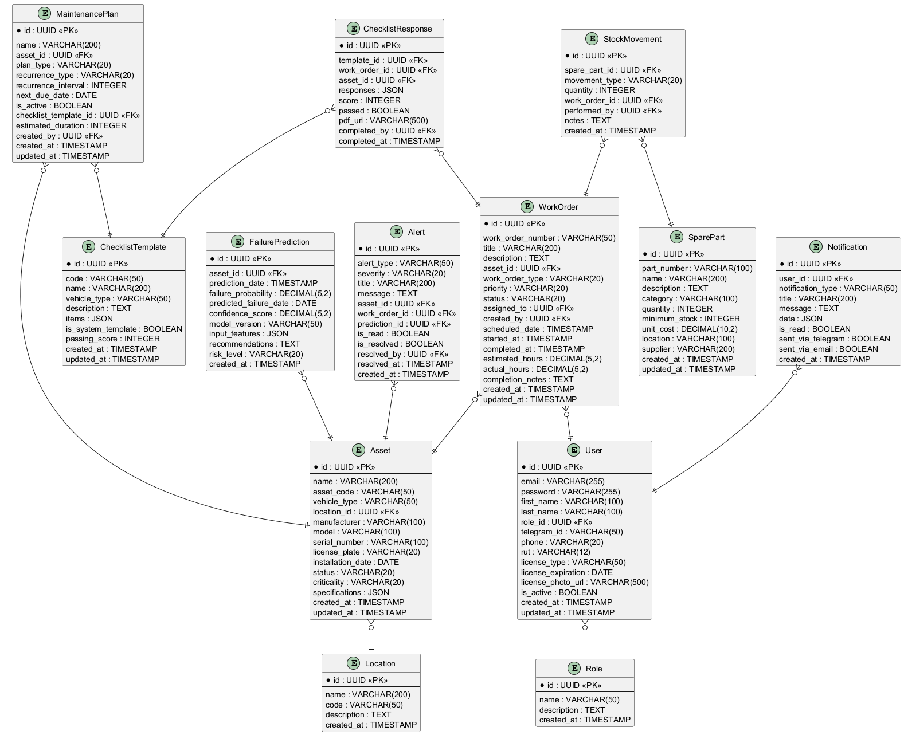
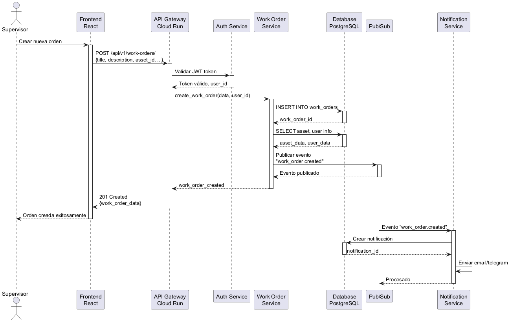
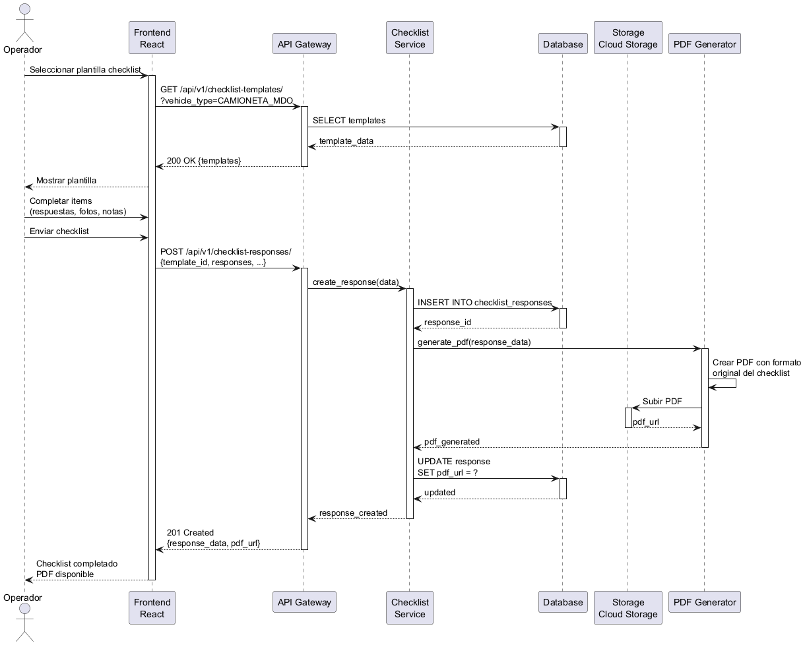

# Diagramas del Sistema CMMS SOMACOR

Este directorio contiene todos los diagramas generados en formato PNG desde PlantUML.

## Diagramas Disponibles

### 1. Diagrama de Casos de Uso
**Archivo:** `casos_uso_cmms.png`

Muestra todos los actores del sistema (Administrador, Supervisor, Operador, Sistema Externo) y sus casos de uso asociados, organizados por módulos funcionales.



---

### 2. Diagrama de Componentes
**Archivo:** `componentes_cmms.png`

Representa la arquitectura de componentes del sistema, incluyendo:
- Frontend React
- Backend Django
- Servicios GCP (Cloud SQL, Cloud Storage, Pub/Sub, Composer, Vertex AI)
- Servicios externos (SendGrid, Telegram Bot)



---

### 3. Diagrama de Modelo de Datos (ER)
**Archivo:** `modelo_datos_cmms.png`

Diagrama entidad-relación completo con todas las tablas del sistema:
- User, Role
- Asset, Location
- WorkOrder, MaintenancePlan
- ChecklistTemplate, ChecklistResponse
- SparePart, StockMovement
- FailurePrediction, Alert, Notification



---

### 4. Diagrama de Secuencia - Crear Orden de Trabajo
**Archivo:** `secuencia_crear_orden.png`

Flujo completo de creación de una orden de trabajo:
1. Supervisor crea orden desde el frontend
2. API valida autenticación
3. Se guarda en base de datos
4. Se publica evento en Pub/Sub
5. Se envían notificaciones



---

### 5. Diagrama de Secuencia - Completar Checklist
**Archivo:** `secuencia_completar_checklist.png`

Flujo de ejecución de checklist:
1. Operador selecciona plantilla
2. Completa items con respuestas y fotos
3. Sistema genera PDF
4. PDF se almacena en Cloud Storage
5. Se actualiza registro en base de datos



---

## Fuente Original

Todos estos diagramas fueron generados desde el archivo `diagramas_plantuml.md` ubicado en la raíz del proyecto.

## Cómo Regenerar los Diagramas

Si necesitas regenerar los diagramas:

1. Asegúrate de tener Java instalado
2. Descarga PlantUML: https://plantuml.com/download
3. Ejecuta:
   ```bash
   java -jar plantuml.jar -tpng diagramas_plantuml.md
   ```

O usa la extensión PlantUML de VS Code (ya instalada).

---

**Fecha de generación:** 19 de Noviembre de 2025  
**Formato:** PNG  
**Total de diagramas:** 5
