# 📊 Diagramas PlantUML - Sistema CMMS SOMACOR

**Fecha**: 18 de Noviembre de 2025

---

## 1. Diagrama de Casos de Uso

```plantuml
@startuml casos_uso_cmms
left to right direction
skinparam packageStyle rectangle

actor "Administrador" as admin
actor "Supervisor" as supervisor
actor "Operador" as operador
actor "Sistema Externo" as sistema

rectangle "Sistema CMMS SOMACOR" {
  
  package "Gestión de Usuarios" {
    usecase "Crear Usuario" as UC1
    usecase "Modificar Usuario" as UC2
    usecase "Eliminar Usuario" as UC3
    usecase "Asignar Roles" as UC4
  }
  
  package "Gestión de Activos" {
    usecase "Registrar Activo" as UC5
    usecase "Modificar Activo" as UC6
    usecase "Consultar Activo" as UC7
    usecase "Cargar Documentos" as UC8
  }
  
  package "Órdenes de Trabajo" {
    usecase "Crear Orden de Trabajo" as UC9
    usecase "Asignar Orden" as UC10
    usecase "Completar Orden" as UC11
    usecase "Consultar Órdenes" as UC12
  }
  
  package "Checklists" {
    usecase "Seleccionar Plantilla" as UC13
    usecase "Completar Checklist" as UC14
    usecase "Generar PDF" as UC15
    usecase "Firmar Digitalmente" as UC16
  }
  
  package "Inventario" {
    usecase "Registrar Repuesto" as UC17
    usecase "Ajustar Stock" as UC18
    usecase "Consultar Inventario" as UC19
    usecase "Alertas Stock Bajo" as UC20
  }
  
  package "Mantenimiento" {
    usecase "Crear Plan Mantenimiento" as UC21
    usecase "Programar Mantenimiento" as UC22
    usecase "Generar Órdenes Automáticas" as UC23
  }
  
  package "Reportes y Analytics" {
    usecase "Generar Reportes" as UC24
    usecase "Consultar KPIs" as UC25
    usecase "Exportar Datos" as UC26
  }
  
  package "Notificaciones" {
    usecase "Enviar Notificación" as UC27
    usecase "Configurar Preferencias" as UC28
  }
  
  package "Predicciones IA" {
    usecase "Predecir Fallas" as UC29
    usecase "Generar Alertas" as UC30
  }
}

' Relaciones Administrador
admin --> UC1
admin --> UC2
admin --> UC3
admin --> UC4
admin --> UC5
admin --> UC6
admin --> UC7
admin --> UC8
admin --> UC17
admin --> UC18
admin --> UC19
admin --> UC21
admin --> UC22
admin --> UC24
admin --> UC25
admin --> UC26
admin --> UC28

' Relaciones Supervisor
supervisor --> UC7
supervisor --> UC9
supervisor --> UC10
supervisor --> UC12
supervisor --> UC13
supervisor --> UC19
supervisor --> UC21
supervisor --> UC22
supervisor --> UC24
supervisor --> UC25

' Relaciones Operador
operador --> UC7
operador --> UC11
operador --> UC12
operador --> UC13
operador --> UC14
operador --> UC15
operador --> UC16
operador --> UC19

' Relaciones Sistema
sistema --> UC23
sistema --> UC27
sistema --> UC29
sistema --> UC30

' Relaciones include/extend
UC9 ..> UC27 : <<include>>
UC10 ..> UC27 : <<include>>
UC11 ..> UC27 : <<include>>
UC14 ..> UC15 : <<include>>
UC15 ..> UC16 : <<extend>>
UC18 ..> UC20 : <<include>>
UC22 ..> UC23 : <<include>>
UC29 ..> UC30 : <<include>>

@enduml
```



---

## 2. Diagrama de Componentes


---

## 3. Diagrama Entidad-Relación (ER)


---

## 4. Diagrama de Arquitectura de Software

```plantuml
@startuml arquitectura_software_cmms
!include <C4/C4_Container>

LAYOUT_WITH_LEGEND()

title Arquitectura de Software - Sistema CMMS SOMACOR

Person(usuario, "Usuario", "Admin, Supervisor, Operador")
Person(tecnico, "Técnico", "Usuario móvil")

System_Boundary(cmms, "Sistema CMMS SOMACOR") {
    Container(web, "Aplicación Web", "React 18, TypeScript", "Interfaz de usuario responsive")
    Container(api, "API REST", "Django 4.x, DRF", "Lógica de negocio y endpoints")
    Container(worker, "Workers", "Celery", "Tareas asíncronas")
    ContainerDb(db, "Base de Datos", "PostgreSQL 15", "Almacenamiento de datos")
    Container(cache, "Caché", "Redis", "Caché de sesiones y datos")
    Container(storage, "Almacenamiento", "Cloud Storage", "Archivos y documentos")
}

System_Ext(pubsub, "Cloud Pub/Sub", "Sistema de mensajería")
System_Ext(composer, "Cloud Composer", "Orquestación de workflows")
System_Ext(vertexai, "Vertex AI", "Predicciones ML")
System_Ext(email, "SendGrid", "Envío de emails")
System_Ext(telegram, "Telegram Bot", "Notificaciones móviles")

Rel(usuario, web, "Usa", "HTTPS")
Rel(tecnico, web, "Usa", "HTTPS")
Rel(web, api, "Consume", "REST/JSON")
Rel(api, db, "Lee/Escribe", "SQL")
Rel(api, cache, "Lee/Escribe", "Redis Protocol")
Rel(api, storage, "Almacena", "HTTPS")
Rel(api, pubsub, "Publica eventos", "HTTPS")
Rel(api, worker, "Encola tareas", "Redis")
Rel(worker, db, "Lee/Escribe", "SQL")
Rel(worker, storage, "Almacena", "HTTPS")
Rel(pubsub, telegram, "Notifica", "Webhook")
Rel(composer, api, "Ejecuta", "HTTPS")
Rel(api, vertexai, "Predice", "HTTPS")
Rel(worker, email, "Envía", "HTTPS")

@enduml
```



---

## 5. Diagrama de Topología de Red

```plantuml
@startuml topologia_red_cmms
!include <C4/C4_Deployment>

LAYOUT_WITH_LEGEND()

title Topología de Red - Sistema CMMS SOMACOR

Deployment_Node(internet, "Internet", "Red Pública") {
    Deployment_Node(users, "Usuarios", "Navegadores Web") {
        Container(browser, "Navegador", "Chrome, Firefox, Safari", "Cliente web")
    }
}

Deployment_Node(gcp, "Google Cloud Platform", "us-central1") {
    
    Deployment_Node(cdn, "Firebase Hosting", "CDN Global") {
        Container(frontend, "Frontend", "React App", "Aplicación estática")
    }
    
    Deployment_Node(cloudrun, "Cloud Run", "Serverless") {
        Container(backend, "Backend API", "Django", "1-10 instancias")
    }
    
    Deployment_Node(cloudsql, "Cloud SQL", "Managed Database") {
        ContainerDb(database, "PostgreSQL", "15.4", "Base de datos principal")
    }
    
    Deployment_Node(memorystore, "Memorystore", "Managed Redis") {
        ContainerDb(redis, "Redis", "7.x", "Caché y sesiones")
    }
    
    Deployment_Node(gcs, "Cloud Storage", "Object Storage") {
        Container(storage, "Buckets", "Standard", "Archivos y documentos")
    }
    
    Deployment_Node(pubsub_node, "Cloud Pub/Sub", "Messaging") {
        Container(pubsub, "Topics/Subs", "Pub/Sub", "Mensajería asíncrona")
    }
    
    Deployment_Node(composer_node, "Cloud Composer", "Airflow") {
        Container(airflow, "DAGs", "Airflow 2.x", "Orquestación")
    }
    
    Deployment_Node(vertex_node, "Vertex AI", "ML Platform") {
        Container(ml, "Modelos ML", "Scikit-learn", "Predicciones")
    }
}

Rel(browser, frontend, "HTTPS:443", "TLS 1.3")
Rel(browser, backend, "HTTPS:443", "REST API")
Rel(backend, database, "TCP:5432", "PostgreSQL")
Rel(backend, redis, "TCP:6379", "Redis Protocol")
Rel(backend, storage, "HTTPS:443", "Cloud Storage API")
Rel(backend, pubsub, "HTTPS:443", "Pub/Sub API")
Rel(backend, ml, "HTTPS:443", "Vertex AI API")
Rel(airflow, backend, "HTTPS:443", "REST API")

@enduml
```



---

## 6. Diagrama de Infraestructura GCP

```plantuml
@startuml infraestructura_gcp_cmms
!include <gcp/GCPCommon>
!include <gcp/Compute/Cloud_Run>
!include <gcp/Databases/Cloud_SQL>
!include <gcp/Storage/Cloud_Storage>
!include <gcp/Networking/Cloud_Load_Balancing>
!include <gcp/Management/Cloud_Monitoring>
!include <gcp/Management/Cloud_Logging>
!include <gcp/Data_Analytics/Cloud_Composer>
!include <gcp/AI_and_Machine_Learning/Vertex_AI>

title Infraestructura GCP - Sistema CMMS SOMACOR

package "Región: us-central1" {
    
    package "Frontend" {
        node "Firebase Hosting" as firebase {
            component "React App" as react
            component "CDN Global" as cdn
        }
    }
    
    package "Backend" {
        Cloud_Run(cloudrun, "Cloud Run", "Backend API")
        component "Auto-scaling\n1-10 instancias" as scaling
    }
    
    package "Datos" {
        Cloud_SQL(cloudsql, "Cloud SQL", "PostgreSQL 15")
        component "Backups\nAutomáticos" as backups
        component "Réplica\nLectura" as replica
    }
    
    package "Almacenamiento" {
        Cloud_Storage(storage, "Cloud Storage", "Buckets")
        component "cmms-documents" as docs
        component "cmms-reports" as reports
        component "cmms-ml-models" as models
    }
    
    package "Mensajería" {
        component "Cloud Pub/Sub" as pubsub
        component "Topics" as topics
        component "Subscriptions" as subs
    }
    
    package "Orquestación" {
        Cloud_Composer(composer, "Cloud Composer", "Airflow 2.x")
        component "DAGs" as dags
    }
    
    package "Machine Learning" {
        Vertex_AI(vertexai, "Vertex AI", "Predicciones")
        component "Modelos\nEntrenados" as mlmodels
    }
    
    package "Monitoreo" {
        Cloud_Monitoring(monitoring, "Cloud Monitoring", "Métricas")
        Cloud_Logging(logging, "Cloud Logging", "Logs")
    }
}

react --> cloudrun : HTTPS
cloudrun --> cloudsql : Private IP
cloudrun --> storage : API
cloudrun --> pubsub : API
cloudrun --> vertexai : API
composer --> cloudrun : HTTPS
cloudrun --> monitoring : Métricas
cloudrun --> logging : Logs

@enduml
```

---

## 7. Diagrama de Secuencia - Crear Orden de Trabajo

```plantuml
@startuml secuencia_crear_orden
actor Supervisor
participant "Frontend\nReact" as Frontend
participant "API Gateway\nCloud Run" as API
participant "Auth Service" as Auth
participant "Work Order\nService" as WO
participant "Database\nPostgreSQL" as DB
participant "Pub/Sub" as PubSub
participant "Notification\nService" as Notif

Supervisor -> Frontend: Crear nueva orden
activate Frontend

Frontend -> API: POST /api/v1/work-orders/\n{title, description, asset_id, ...}
activate API

API -> Auth: Validar JWT token
activate Auth
Auth --> API: Token válido, user_id
deactivate Auth

API -> WO: create_work_order(data, user_id)
activate WO

WO -> DB: INSERT INTO work_orders
activate DB
DB --> WO: work_order_id
deactivate DB

WO -> DB: SELECT asset, user info
activate DB
DB --> WO: asset_data, user_data
deactivate DB

WO -> PubSub: Publicar evento\n"work_order.created"
activate PubSub
PubSub --> WO: Evento publicado
deactivate PubSub

WO --> API: work_order_created
deactivate WO

API --> Frontend: 201 Created\n{work_order_data}
deactivate API

Frontend --> Supervisor: Orden creada exitosamente
deactivate Frontend

PubSub -> Notif: Evento "work_order.created"
activate Notif

Notif -> DB: Crear notificación
activate DB
DB --> Notif: notification_id
deactivate DB

Notif -> Notif: Enviar email/telegram
Notif --> PubSub: Procesado
deactivate Notif

@enduml
```



---

## 8. Diagrama de Secuencia - Completar Checklist


---

## Notas de Uso

### Cómo Generar los Diagramas

1. **Online**: Usar https://www.plantuml.com/plantuml/uml/
2. **VS Code**: Instalar extensión "PlantUML"
3. **CLI**: Instalar PlantUML y ejecutar:
   ```bash
   plantuml diagrama.puml
   ```

### Exportar a Imágenes

```bash
# PNG
plantuml -tpng diagrama.puml

# SVG (mejor calidad)
plantuml -tsvg diagrama.puml

# PDF
plantuml -tpdf diagrama.puml
```

### Incluir en Documento Word

1. Generar imágenes PNG o SVG
2. Insertar en Word: Insertar > Imágenes
3. Ajustar tamaño según necesidad
4. Agregar pie de figura con descripción

---

**Diagramas creados**: 18 de Noviembre de 2025  
**Formato**: PlantUML  
**Total de diagramas**: 8

